  

  
  
  
  
  
  

---

  

## 🎯 Mission Statement

> *"Transforming healthcare through AI, one algorithm at a time. Building intelligent systems that don't just predict the future—they create it."*

---

## 🚀 About Me

```mermaid
graph TD
    A[🎓 Computer Science Student<br/>SREC, Coimbatore] --> B[🤖 ML Engineer<br/>Bumblebee.inc]
    B --> C[🏥 Healthcare AI<br/>Aether Med Startup]
    C --> D[🌍 Global Impact<br/>Atlanta, Georgia]
    D --> E[🚀 Future Vision<br/>AI Revolution]
    
    style A fill:#00D4FF,stroke:#fff,stroke-width:2px,color:#000
    style B fill:#FF6B6B,stroke:#fff,stroke-width:2px,color:#fff
    style C fill:#4ECDC4,stroke:#fff,stroke-width:2px,color:#000
    style D fill:#45B7D1,stroke:#fff,stroke-width:2px,color:#fff
    style E fill:#96CEB4,stroke:#fff,stroke-width:2px,color:#000
```

- 🎓 **Computer Science** student at Sri Ramakrishna Engineering College (2022-2026)
- 🤖 **Aspiring ML Engineer** with expertise in Prompt Engineering and Healthcare AI
- 🏥 **Healthcare Innovator** - Leading Aether Med startup revolutionizing telemedicine
- 🌍 **Global Perspective** - Studied in Mexico, working from Atlanta, Georgia
- 🏆 **Student Leader** - President of Student Council (2024-2026)
- 🧠 **AI Specialist** - Deep expertise in LLMs, GANs, and Computer Vision

---

## 🛠️ Tech Arsenal

### 🎨 Core Technologies

### 🏷️ Technology Badges

---

## 📊 Professional Journey

### 🗓️ Career Timeline

---

## 🏆 Certifications & Achievements

### 🎓 Professional Certifications

<table>
<tr>
<td width="50%">

#### 🧠 Deep Learning Specialization
**Coursera**
- Neural Networks & CNNs
- RNNs & Optimization
- Advanced ML Techniques

#### ☁️ AWS ML Specialty
**Amazon Web Services**
- Cloud ML Deployment
- Production Workflows
- Scalable AI Solutions

</td>
<td width="50%">

#### 🤖 Google ML Engineer
**Google Cloud**
- Production ML Workflows
- Data Pipelines
- Enterprise Deployment

#### 🏥 AI for Healthcare
**Udacity**
- Medical AI Solutions
- Healthcare-Specific ML
- Clinical Applications

</td>
</tr>
</table>

### 🏅 Additional Credentials

- **MIT Professional Certificate** in Machine Learning & AI
- **Student Council President** (2024-2026)
- **Hackathon Mentor** - Guiding AI/LLM implementations
- **Workshop Conductor** - NLP technical workshops

---

## 🚀 Featured Projects

### 🏗️ Project Ecosystem

### 🔥 Project Showcase

<table>
<tr>
<td width="50%">

#### 🏥 Aether Med
**Healthcare AI Startup | Project Manager & Lead Developer**

- 🎭 **AR3D Telemedicine Platform** - Revolutionary patient interaction
- 📈 **35% Engagement Boost** - LLM integration results
- 👥 **20+ Team Leadership** - Cross-functional Agile management
- 🤝 **Strategic Partnerships** - 40% platform adoption increase
- 🌍 **Global Impact** - Atlanta, Georgia operations

**Tech Stack:** AR3D, LLMs, Agile, Healthcare APIs

</td>
<td width="50%">

#### 🧠 Autonomous Medical Diagnosis
**ML Architect & Deployment Engineer**

- 🔍 **Multi-modal Analysis** - Images, text, and vitals
- 🎯 **YOLOv8 Integration** - Real-time medical imaging
- 🤖 **Flamingo LLM** - DeepMind's multi-modal model
- ⚡ **Real-time Processing** - X-rays, MRIs, CT scans
- 🏥 **Clinical Deployment** - Production-ready system

**Tech Stack:** PyTorch, TensorFlow, OpenCV, Flask/Django

</td>
</tr>
<tr>
<td width="50%">

#### 🎯 Intelligent Task Manager
**Prompt Designer & NLP Specialist**

- 📅 **Automated Scheduling** - Deadline and priority-based
- 🧠 **GPT Integration** - Task-specific prompt generation
- 🔗 **Calendar Integration** - Seamless workflow
- ⚡ **Reinforcement Learning** - Adaptive optimization
- 📱 **Cross-platform** - Universal productivity tool

**Tech Stack:** OpenAI GPT API, LangChain, AWS Lambda

</td>
<td width="50%">

#### 🌍 Real-time Multilingual AI
**Model Trainer & Voice Specialist**

- 🗣️ **Voice-based Assistant** - Natural communication
- 🔄 **Real-time Translation** - Instant multilingual support
- 📝 **Transcription & Summarization** - Comprehensive processing
- ⚡ **Low Latency** - Production-ready performance
- 📞 **Twilio Integration** - Voice communication platform

**Tech Stack:** PyTorch, Whisper API, LangChain, Twilio

</td>
</tr>
</table>

---

## 📈 GitHub Analytics

### 📊 Development Insights

---

## 🎨 Development Philosophy

- **🧠 AI-First Thinking** → Every solution starts with intelligence
- **🏥 Healthcare Impact** → Technology that saves lives
- **⚡ Rapid Prototyping** → Fast iteration, faster results
- **🌍 Global Perspective** → Building for worldwide impact
- **🤝 Collaborative Leadership** → Empowering teams to excel
- **📚 Continuous Learning** → Always evolving with technology

---

## 🌟 Vision & Mission

> *"You're my constant, my North Star — guiding me no matter where I am."*

This philosophy drives both my personal relationships and the AI systems I build — seeking consistency, clarity, and direction in everything I do. From healthcare AI that provides reliable diagnoses to productivity tools that adapt to user needs, I believe in creating technology that serves as a constant, reliable guide.

---

## 🎯 Currently Working On

```mermaid
graph LR
    A[🏥 Aether Med] --> B[🌍 Global Expansion]
    B --> C[🤖 Advanced AI]
    C --> D[📱 Mobile Integration]
    D --> E[🎯 Healthcare Revolution]
    
    style A fill:#00D4FF,stroke:#fff,stroke-width:2px
    style B fill:#FF6B6B,stroke:#fff,stroke-width:2px
    style C fill:#4ECDC4,stroke:#fff,stroke-width:2px
    style D fill:#96CEB4,stroke:#fff,stroke-width:2px
    style E fill:#45B7D1,stroke:#fff,stroke-width:2px
```

**Revolutionizing healthcare through AI-powered telemedicine and autonomous diagnosis systems**

---

## 🏆 GitHub Achievements

---

## 📫 Let's Connect & Collaborate

### 🌐 Professional Networks

### 🚀 Let's Build the Future Together

**Open to:**
- 🤝 **Collaborations** on AI/ML projects
- 💼 **Internship opportunities** in healthcare AI
- 🎯 **Research partnerships** in medical technology
- 🌍 **Global projects** with social impact

---

---

  
  
  

---

  
  **🔥 Building the future of healthcare AI, one algorithm at a time.**
  
  
  

---

  
  
  

